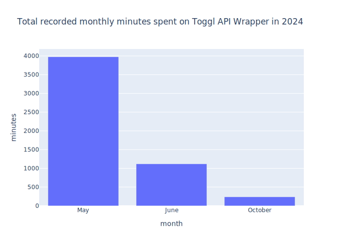

All Tracker, Client, Project & Tag endpoints will have most of these methods:

1. **collect**: Gathering models.
2. **get**: Retrieving a model.
3. **delete**: Deleting a model.
4. **edit**: Editing a model.
5. **add**: Creating a new model.

---

> [!INFO]
> With environment variables setup correctly.

### Tracker Example

```python

```

**Outputs**:

```python
>>> TogglTracker(
        id=3482231563,
        name="My First Tracker",
        workspace=2313123123,
        start=datetime.datetime(2024, 6, 10, 14, 59, 20, tzinfo=datetime.timezone.utc),
        duration=datetime.timedelta(seconds=1, microseconds=179158),
        stop=None,
        project=None,
        tags=[],
    )
```

### Project Example

> [!INFO]
> Using an existing togglrc file.

```python

```

**Outputs**:

```python
>>> TogglProject(
        id=203366783,
        name='My First Project',
        workspace=2313123123,
        color='#d92b2b',
        client=65298912,
        active=True,
    )
```

### Report Example

- With **Plotly**, **Pandas** and **Kaleidoscope** installed.

```python

```

**Outputs**:



### Asyncio Example

- With all dependencies from `toggl-api-wrapper[async]`

```python

```

**Outputs**:

```python
>>> TogglProject(
        id=208596838,
        name='New Project',
        workspace=8876353,
        color='#0b83d9',
        client=None,
        active=True,
        start_date=datetime.date(2025, 1, 22),
        end_date=None
    )
```

### Logging Example

```python

```

**Outputs**:

```
INFO [2024-10-15 12:08:21] toggl-api-wrapper - Detected an api token as authentication.
INFO [2024-10-15 12:08:21] httpx - HTTP Request: GET https://api.track.toggl.com/api/v9/me/logged "HTTP/1.1 200 OK"
```

## Applications Using Toggl API Wrapper

- [Ulauncher Toggl Extension](https://github.com/ddkasa/ulauncher-toggl-extension)
